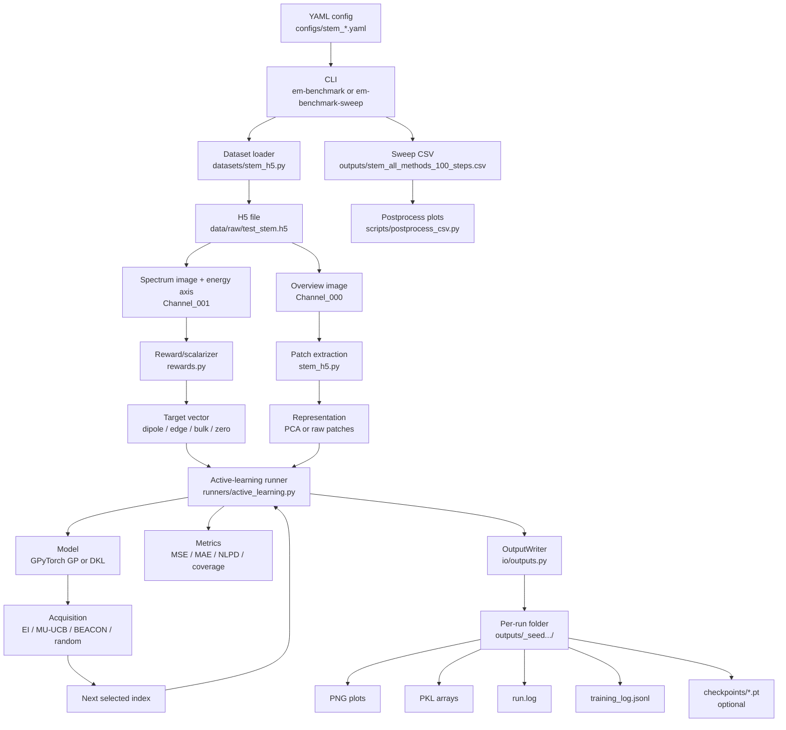

# STEM Dummy Data Pipeline

This document explains how the benchmark runs on the DTMicroscope STEM test file:

```text
data/raw/test_stem.h5
```

The file is treated as a small, shareable stand-in for live microscope data. It contains:

- an overview image
- a spectrum image
- an energy axis

The benchmark turns those into image patches, scalarizer rewards, active-learning decisions, metrics, plots, logs, and CSV summaries.

## Pipeline Graph



## From YAML To Run

A single-method run starts from a YAML file such as:

```bash
uv run em-benchmark --config configs/stem_dkl_ei.yaml
```

A multi-method comparison starts from:

```bash
uv run em-benchmark-sweep --config configs/stem_all_methods.yaml
```

The YAML controls:

- dataset path and scalarizer reward
- patch size
- model choice
- representation choice
- acquisition function
- BO seed points and number of BO steps
- output behavior
- model checkpoint save/load behavior

Example dataset block:

```yaml
dataset:
  name: stem_h5
  path: data/raw/test_stem.h5
  patch_size: 8
  reward: dipole
  normalize_reward: true
```

## Data Loading

The loader lives in:

```text
src/MicroscopyStructurePropertyBenchmark/datasets/stem_h5.py
```

It reads:

```text
Measurement_000/Channel_000/generic/generic
Measurement_000/Channel_001/generic/generic
Measurement_000/Channel_001/generic/energy_scale
```

The overview image becomes the spatial image used for patch extraction and plotting.

The spectrum image plus energy axis goes into the scalarizer.

## Reward / Scalarizer

Scalarizers live in:

```text
src/MicroscopyStructurePropertyBenchmark/rewards.py
```

Supported scalarizers:

```text
dipole: 0.35-0.55 eV
edge:   0.60-0.75 eV
bulk:   0.80-1.00 eV
zero:   control/debug scalarizer
```

For `dipole`, the code sums spectrum intensity over the dipole energy window, then optionally normalizes the resulting scalarizer map to `[0, 1]`.

## Features And Models

The dataset returns:

```text
image   -> 2D overview image
patches -> N x patch_size x patch_size
coords  -> N x 2 row/column coordinates
target  -> scalarizer value at each coordinate
```

Then the runner chooses the representation:

- `pca`: flatten patches and run `sklearn.decomposition.PCA`
- `patches`: use raw image patches for DKL

Implemented model paths:

- `pca_gp_ei`: PCA representation + exact GPyTorch GP + BoTorch expected improvement
- `pca_gp_mu`: PCA representation + exact GPyTorch GP + high-beta BoTorch upper confidence bound
- `pca_gp_random`: PCA representation + exact GPyTorch GP + random acquisition
- `dkl_ei`: raw patches + DKL + BoTorch expected improvement
- `dkl_mu`: raw patches + DKL + high-beta BoTorch upper confidence bound
- `dkl_beacon`: raw patches + DKL + BEACON-style acquisition
- `dkl_random`: raw patches + DKL + random acquisition

## Active-Learning Loop

The main loop lives in:

```text
src/MicroscopyStructurePropertyBenchmark/runners/active_learning.py
```

Each BO step does:

1. Train the model on acquired points.
2. Predict over all candidate points.
3. Score unacquired candidates with the acquisition function.
4. Select the next index.
5. Update the acquired set.
6. Compute metrics over the full scalarizer map.
7. Write outputs and logs.

Tracked metrics:

- `mse`
- `mae`
- `nlpd`
- `coverage`
- `mean_prediction`
- `mean_variance`
- `loss_initial`
- `loss_final`

## Single-Run Outputs

When `output.enabled: true`, each run writes a folder like:

```text
outputs/stem_dkl_ei_seed11_YYYYMMDD_HHMMSS/
```

Inside:

```text
Active_learning_statistics.pkl
AL_traj.png
predictions_BO_step0.pkl
predictions_BO_step0.png
...
run.log
training_log.jsonl
checkpoints/model_step000.pt
checkpoints/latest.pt
```

`predictions_BO_step<N>.png` shows:

- original image with selected point
- predicted mean
- predicted variance
- true scalarizer

`Active_learning_statistics.pkl` stores:

- acquired order
- seed indices
- remaining unacquired indices
- image
- features
- coordinates
- metric traces

## Logs

Each output folder has two log files.

`run.log` is human-readable. It includes:

- run start
- dataset summary
- feature summary
- selected index per step
- metrics per step
- loss initial/final per step
- final metrics

`training_log.jsonl` is structured. Each line is a JSON object. Events include:

- `run_start`
- `bo_step`
- `run_final`

Each `bo_step` contains:

- selected index and coordinate
- number of acquired points
- MSE, MAE, NLPD, coverage
- mean prediction and mean variance
- selected target/prediction/variance
- model diagnostics
- full training loss trace

This file is meant for debugging training behavior and comparing runs programmatically.

## Model Checkpoints

Model checkpoints are optional and controlled from YAML:

```yaml
checkpoint:
  save_model: true
  load_model_path:
```

When enabled, each BO step writes:

```text
checkpoints/model_step000.pt
checkpoints/model_step001.pt
checkpoints/latest.pt
```

The checkpoint is a `torch.save` dictionary with:

- model type
- BO step
- model config
- model state dict
- likelihood state dict
- training loss trace
- metadata such as selected index and metrics

To warm-start a later run from a saved model:

```yaml
checkpoint:
  save_model: false
  load_model_path: outputs/stem_dkl_ei_seed11_.../checkpoints/latest.pt
```

This loads model weights before training at each BO step. It does not resume the full BO state; acquired/unacquired sets still come from the current run config.

## Sweep Outputs

The all-method sweep config is:

```text
configs/stem_all_methods.yaml
```

Run:

```bash
uv run em-benchmark-sweep --config configs/stem_all_methods.yaml
```

It writes:

```text
outputs/stem_all_methods_100_steps.csv
outputs/stem_all_methods_100_steps.log
outputs/stem_all_methods_100_steps_log.jsonl
```

CSV columns:

```text
method,step,selected_index,mse,mae,nlpd,coverage,mean_prediction,mean_variance,loss_initial,loss_final
```

Generate comparison plots:

```bash
uv run python scripts/postprocess_csv.py --csv outputs/stem_all_methods_100_steps.csv
```

This creates:

```text
outputs/stem_all_methods_100_steps_plots/
```

with per-metric plots and `metric_summary.png`.

The sweep logs record:

- sweep start/end
- method start/end
- method row counts
- final metrics per method
- method errors, if any
